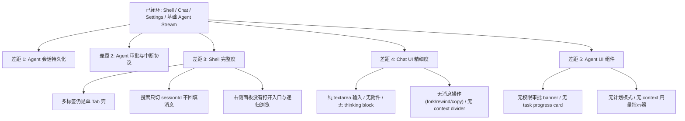

# j-gui 相对 Proma 的当前差距

## 速答

**j-gui 已经跨过"能不能跑起来"的阶段，但还没到 Proma 那种可持续工作的 Agent 工作台。** 当前基础壳、Chat 闭环、配置与基础 Agent 流式输出都已经具备，真正的差距集中在三层：

1. **Agent 会话模型**：现在的 Agent 对话还是内存态，不能像 Chat 那样进入会话列表、搜索、切换、恢复。
2. **Agent 中断/审批协议**：当前只有 `assistantContent` / `toolUse` / `toolResult` / `done` / `error` 这类只读事件，没有"继续 / 批准 / 拒绝"回传链路。
3. **Shell 完整度**：多标签、搜索后的消息回填、右侧工作区面板都还只是半闭环。
4. **Chat UI 精细度**：输入框、消息气泡、流式渲染、上下文管理在功能上可用，但与 Proma 的 polished 体验差距明显。
5. **Agent UI**：工具调用展示、任务进度聚合、权限审批交互、计划模式、上下文用量指示器——这些 Proma 的 Agent UI 组件在 j-gui 中基本是空白的。
6. **Agent 治理面**：首版现已决定纳入 `MCP 配置 UI`、`Skills UI`、`Hooks UI`，但落地时不能只抄 Settings 壳，必须分别锚定 j-cli 现有 Skills/Hooks 语义与 MCP 的真实配置契约；其中 `MCP` 只挂 Agent runtime，不扩写到当前 Chat 路径。

这意味着当前产品更接近 **"Chat 优先的桌面壳 + Agent 流式预览"**，而不是 **"Proma 风格的 Agent 工作台"**。roadmap 里有几项被高估为 `done`，同时还缺 2 个真正的核心条目：**Agent 中断协议** 和 **Agent 会话存储/导航**。

## 关键证据

### 1. 主区域仍是固定单 Tab，离 Proma 的标签工作区还有一段距离

- `src/components/app-shell/MainArea.tsx:23-24` 把 `tabs` 固定为单个 `default` tab，`activeTabId` 也固定不变。
- `src/components/app-shell/MainArea.tsx:54-61` 内容区只是按当前 `mode` 在同一个槽位里切 `ChatView` / `AgentView`。
- 这说明当前只是"有 Tab 样子"，不是"有 Tab 能力"。

**Proma 对比**：Proma 的 TabBar 支持动态多个标签（Chat 和 Agent 混合）、Chrome 风格等宽布局、中键关闭、拖拽重排（5px 阈值）、滚轮横向滚动、hover 预览面板（300ms 延迟显示消息缩略图）、关闭确认对话框（流式传输中关闭标签时确认）。每个 Tab 包在独立的 ErrorBoundary 内，一个标签崩溃不影响其他。状态通过 `tabsAtom` / `activeTabIdAtom` Jotai atoms 管理。

### 2. Agent 对话仍是纯内存态，没有进入会话系统

- `src/atoms/sessions.ts:29-33` 只定义了 `agentMessagesAtom` / `agentStreamingAtom`，没有 Agent 会话列表或持久化索引。
- `src/components/agent/AgentView.tsx:167-189` 发送 Agent 消息时只往 `agentMessagesAtom` 追加，没有 session id、没有持久化调用。
- `src/components/app-shell/LeftSidebar.tsx:78-108` 新建/切换会话逻辑全部强制 `setMode("chat")`，并且只通过 `getSessionMessages()` 回填 Chat 消息。
- `src/lib/tauri.ts:133-150` 与 `src-tauri/src/commands/agent.rs:7-35` 只暴露 `start_agent` / `send_agent_message` / `stop_agent`，没有 list/get/delete/resume 这类 Agent 会话接口。

### 3. Agent 审批链路还没真正开始，当前只有只读流，没有回传协议

- `src/lib/tauri.ts:133-150` 定义的 `AgentEvent` 只有 `assistantContent`、`toolUse`、`toolResult`、`done`、`error`。
- `src-tauri/src/commands/agent.rs:18-35` 只有发送消息和停止引擎，没有"批准 / 拒绝 / 继续计划"类命令。
- `src/components/agent/AgentView.tsx:51-130` 事件分发也只覆盖上述五类事件，没有任何 banner/interrupt 分支。
- 这说明当前 Tool Call 只是展示，不是 Proma 那种可交互的 Agent 审批流。

**Proma 对比**：Proma 的 Agent 审批体系有三层：
- **PermissionBanner**：内联卡片（消息和输入框之间），显示工具名、危险等级（safe=绿色 / normal=primary / dangerous=琥珀色）、命令/内容预览（代码块），操作按钮：Allow（Enter）、Always Allow、Deny。支持多队列计数徽章。
- **AskUserBanner**：多问题选项卡界面，支持单选/多选/自定义文本输入，键盘导航（上下箭头 / Enter 确认），预览内容用 react-markdown 渲染，单选问题 150ms 自动推进。
- **ExitPlanModeBanner**：计划审批 UI，四种选项（批准并自动执行 / 批准但手动编辑审批 / 拒绝计划 / 提供反馈），允许的提示词以 pill 徽章展示，反馈文本输入框，键盘 1-4 快速选择。

### 4. 右侧工作区面板还处于半成品：默认关、无打开入口、目录展开不读取子目录

- `src/atoms/sidebar.ts:3-4` 中 `rightPanelOpenAtom` 默认是 `false`。
- `src/components/app-shell/AppShell.tsx:66` 只有在 `rightPanelOpen` 为真时才渲染 `RightSidePanel`。
- `src/components/app-shell/RightSidePanel.tsx:15-18` 组件内部只拿到了"关闭"能力和一个固定 `cwd = "."`。
- `src/components/app-shell/RightSidePanel.tsx:20-33` 只在当前目录执行一次 `readDir`；`43-50` 的 `toggleDir` 只是切换展开状态，没有继续读取子目录内容。

**Proma 对比**：Proma 的 SidePanel 有两个独立区域——"Session files"（会话级文件，独立滚动）和"Workspace files"（跨会话共享）。附带目录以可展开树形式展示，支持重命名/移动/添加到聊天操作；文件浏览器有拖放上传区域；文件夹图标上有脉冲点指示新文件出现；面包屑显示路径最后两段。Panel 有打开/关闭按钮（AgentHeader 内），且有 smooth `transition-[width]` 动画。

### 5. 搜索弹窗能选会话，但不会把会话内容 hydrate 回当前界面

- `src/components/app-shell/SearchDialog.tsx:44-46` 与 `86-88` 选中结果时只执行 `onSelect(id)`。
- `src/components/app-shell/AppShell.tsx:54-56` 的 `handleSelectSession` 也只是 `setSessionId(id)`，没有像左侧栏那样调用 `getSessionMessages()`。
- 这意味着搜索只完成了"定位 session id"，没有完成"打开这段对话"。

**Proma 对比**：Proma 的 SearchDialog 支持双重搜索——标题搜索（即时，客户端过滤，按更新时间排序，最多 20 条）和消息内容搜索（300ms 防抖，IPC 查询，返回片段+高亮位置）。标题结果优先显示，内容结果在后，去重（内容匹配但已在标题结果中的过滤）。高亮用 `<mark>` 标签 + `bg-primary/20`。键盘导航（上下箭头 / Enter / Esc），IME 组合输入处理，自动聚焦。结果中 Chat 用 MessageSquare 图标，Agent 用 Bot 图标，Agent 结果显示 workspace 名称 pill，已归档项显示降低透明度 + Archive 图标。

### 6. roadmap 机器清单对几项能力的完成度判断偏乐观

- `.codestable/roadmap/j-gui-desktop-app/j-gui-desktop-app-items.yaml:69-75` 把 `frontend-main-area` 标成 `done`，但代码仍是固定单 tab。
- `.codestable/roadmap/j-gui-desktop-app/j-gui-desktop-app-items.yaml:117-131` 把 `frontend-permission`、`frontend-right-panel` 标成 `done`，但前者没有命令协议，后者没有打开入口和递归树。
- `.codestable/roadmap/j-gui-desktop-app/j-gui-desktop-app-items.yaml:197-235` 把 `frontend-search`、`frontend-tabs-enhanced` 标成 `done`，但当前分别缺消息回填和多标签增强主体。

---

## 差距矩阵（用于指导实现，不只是描述现状）

| 差距项 | 当前现状 | 缺口类型 | Proma 实现经验 | j-gui 落地约束 | 首版级别 | roadmap |
|------|----------|----------|----------------|----------------|----------|---------|
| 多标签工作区 | `MainArea` 只有固定 `default` tab，`mode` 直接决定唯一内容槽位 | 状态模型 + UI 壳层 | Proma 把 tab 身份、active 状态、预览、关闭确认、错误边界拆开处理；不是一个 `mode` 开关包打天下 | 先把 `tab identity` 从 `app mode` 中分离，再谈预览/拖拽；首版先做打开/关闭/切换，增强特性后置 | P0 | `#9` `#28` |
| Agent 会话生命周期 | Agent 消息只在 Jotai 内存里，切走即丢 | 持久化协议 + 导航状态 | Proma 的 Agent 与 Chat 一样进入可搜索、可恢复、可切换的会话体系 | 必须先定 transcript 存储格式和 `list/get/delete/resume` 命令，前端再接左栏/搜索 | P0 | `#32` `#33` |
| Agent 审批/中断链路 | 只有只读 `AgentEvent`，前端不能回传选择 | IPC 协议 | Proma 把 `permission / ask_user / plan` 当三种不同中断，不共用一个窄响应模型 | `AgentEvent::Interrupt` 与 `InterruptResponse` 必须按类型分型，不能只留 `approve/deny` | P0 | `#31` `#34` |
| 搜索闭环 | `SearchDialog` 选中后只设置 `sessionId`，不 hydrate 消息 | 导航闭环 | Proma 的搜索不是“定位 id”，而是“真正打开目标上下文” | 先补基础回填，再做内容搜索/高亮；不要把两者绑成同一步 | P1 | `#25` `#41` |
| 右侧工作区面板 | 只有顶层读取，默认关闭，无入口，无 lazy children | 文件树状态 + 交互 | Proma 的 panel 是可打开的工作区容器，不只是静态目录列表 | 首版先补入口、递归懒加载、面包屑；重命名/拖放/脉冲点后置 | P1 | `#16` `#43` |
| Chat 输入模型 | 仍是纯 `textarea` + send button | 输入状态 + 消息模型 | Proma 的编辑器状态、附件状态、草稿状态、发送 payload 是分层的 | 先定“消息 payload 是否支持附件/引用/thinking”，再决定 TipTap 是否落地；不要先换编辑器再补协议 | P1 | `#37` |
| Agent 任务进度与上下文工具 | 现在是逐条 tool call 平铺，没有聚合和上下文操作面板 | 展示聚合 + 可操作状态 | Proma 不是单纯渲染 tool_use，而是把 task/tool/context 三类信息做成不同组件 | 任务进度卡依赖明确的 tool 分类规则；Context badge 依赖真实 token 统计来源，不要先做假环形图 | P1 | `#35` `#36` |
| Agent 配置治理（Skills / Hooks / MCP） | 当前设置只有 provider/theme/system prompt，没有技能、hooks、MCP 的治理入口 | 配置契约 + 设置 UI | Proma 给出 Settings 导航与 Skills/MCP 组织方式，j-cli TUI 已给出 Skills/Hooks 的启停语义与列表模型 | Skills/Hooks 复用 j-cli 现有 `disabled_*` 口径；MCP 必须先定义稳定数据源并保留未知字段，不能凭宽泛表单猜 schema，且只作用于 Agent runtime，不向当前 Chat 路径扩张 | P1 | `#44` `#45` `#46` `#47` `#48` |
| 共享消息基元 | Chat 与 Agent 各自临时拼装，缺统一 message/conversation/reasoning 抽象 | 组件边界 | Proma 先沉淀 `ai-elements`，再在 Chat/Agent 上复用 | j-gui 首版不需要完整复制组件库，但至少要先统一 Message/Conversation/Reasoning 三个基元边界 | P2 | `#38` `#39` |
| 设置重构 | 现有 3 tab 可用，但缺导航持久化、未保存保护、原语层 | 表单状态 + UI 原语 | Proma 的设置页不是“一个大弹窗”，而是导航、原语、脏状态三层结构 | 先抽 `settings primitives` 和 `settingsTabAtom`，再扩 tab 数量；不要先堆 tab | P2 | `#42` |

## 吸收 Proma 实现经验的方式

不是“看起来像 Proma”就够了，应该吸收下面 4 类具体经验：

1. **状态拆分经验**
   - Proma 倾向于把 `展示态`、`交互态`、`持久化态` 分开。
   - 例如 tab、search、permission、draft、context usage 都不是一个 atom 全管。
   - j-gui 应优先复用这种拆分思路，而不是把所有状态继续塞进 `appModeAtom` / `currentSessionIdAtom` 一类总开关。

2. **协议分型经验**
   - Proma 的很多复杂 UI 本质上是被后端协议“喂出来”的，不是前端猜出来的。
   - 最典型的是 Agent interrupt：不同 kind 直接决定不同 banner、不同按钮、不同回传 payload。
   - j-gui 这里必须先定协议，再写组件；反过来会导致 UI 先做一套、协议再返工一套。

3. **组件边界经验**
   - Proma 会把“消息容器”“消息内容”“消息操作”“推理块”“任务进度”拆开，而不是一个大组件里硬写分支。
   - j-gui 后续如果不先抽稳定边界，很容易在 `ChatView` / `AgentView` / `ToolCallDisplay` 里继续堆条件分支。

4. **交互阈值经验**
   - Proma 不是只定义“有这个功能”，而是把很多阈值写死在交互里。
   - 例如 search debounce、tab hover preview 延迟、单选 ask_user 自动推进、危险工具的颜色等级、流式中关闭标签确认。
   - j-gui 可以不一开始完全照搬，但这些阈值应该在 design 阶段显式拍板，不能留给实现时临场猜。

## 避免猜测式实现的落地规则

后续每个相关 feature-design 最好都补上这 3 块，不然仍然会滑回“宽泛语义实现”：

- **Proma 参考点**：这次具体吸收的是状态模型、协议字段、还是交互规则。
- **j-gui 取舍**：哪些照搬，哪些简化，哪些明确不做。
- **验收闭环**：用户最终能看到的行为是什么，而不是“组件已经写了”。

一个合格的 feature-design 例子应该长这样：

- `frontend-agent-interrupt-ui`
  - 参考点：Proma 的三类 interrupt banner 分型
  - j-gui 取舍：首版保留 `permission / ask_user / plan` 三分，不做多队列并发审批
  - 验收：三种 interrupt 都能从真实 `AgentEvent::Interrupt` 渲染并正确回传

- `frontend-chat-input-enhanced`
  - 参考点：Proma 的编辑器状态和草稿持久化分层
  - j-gui 取舍：首版先做草稿持久化 + thinking 开关，不强上完整附件体系
  - 验收：切会话后草稿保留，发送 payload 不被 UI 实现细节污染

## UI 层差距详情（对标 Proma）

### App Shell 布局

| 特性 | Proma | j-gui | 差距 |
|------|-------|-------|------|
| 侧栏折叠 | 280px ↔ 48px 平滑动画，折叠态仅图标 + 新建按钮 + 头像 | 已有基础宽度折叠（280px ↔ 48px），但折叠态仍缺图标模式细节与会话操作收纳 | **部分完成** |
| 浮层卡片风格 | `rounded-2xl shadow-xl`，面板间有 padding 分隔 | 纯扁平无边角 | **缺** |
| 标题栏拖拽区 | 固定 `top-0 h-[50px]` 拖拽区，交互元素 `titlebar-no-drag` | 无 | **缺** |
| ModeSwitcher | 滑动 pill 动画，Chat(MessageSquare) ↔ Agent(Bot) | 侧栏底部两个独立按钮 | **粗糙** |
| 归档系统 | 独立 Archive 视图，"Back to active" 返回按钮 | 无 | **缺** |
| Workspace 指示器 | 侧栏底部显示 MCP 数 + Skills 数 | 无 | **缺** |
| 会话列表日期分组 | Today/Yesterday/Earlier 分组 | 已按今天/昨天/更早分组，但缺 Pin/Archive/恢复等更完整的会话组织能力 | **部分完成** |
| 会话项交互 | 双击/悬浮按钮重命名、Pin/Unpin、Archive/Restore、删除确认 | 仅点击切换、删除 | **粗糙** |

### Chat View 精细度

| 特性 | Proma | j-gui | 差距 |
|------|-------|-------|------|
| 输入框 | TipTap(ProseMirror) 富文本编辑器，markdown 格式化支持 | 纯 textarea | **大** |
| 附件预览 | 缩略图网格展示待发送文件 | 无 | **缺** |
| 拖放上传 | 绿色虚线边框 drop zone，区分文件 vs 目录 | 无 | **缺** |
| 输入框工具栏 | Paperclip + ModelSelector + Thinking toggle + ContextSettings + ClearContext + Send/Stop | 仅 Send 按钮 | **大** |
| Thinking/推理块 | `Reasoning` 可折叠组件，含 Trigger + Content | 无 | **缺** |
| Context Divider | 消息间"上下文已清空"分割线 | 无 | **缺** |
| 流式平滑 | `useSmoothStream` hook 逐字符渲染 | 直接 append chunk | **粗糙** |
| 消息操作 | Fork(Rewind) / Copy / 内联编辑再发送 | 删除 / 重发 | **缺** |
| 滚动缩略图 | `ScrollMinimap` — 右侧细条显示消息位置（角色色点） | 无 | **缺** |
| 草稿持久化 | 每个会话独立保存未发送的输入内容 | 无 | **缺** |
| 模型选择器 | Dialog + Command 风格搜索，分组 + 图标 + 绿色选中指示 | 原生 `<select>` 下拉 | **粗糙** |
| 系统提示词 | 专用 `SystemPromptSelector` 在 Header 中 | Popover 内嵌 textarea | **粗糙** |

### Agent View 组件

| 特性 | Proma | j-gui | 差距 |
|------|-------|-------|------|
| AgentHeader | 可编辑标题 + RightSidePanel 切换按钮 + 文件变更脉冲点 | 静态标题 + 模型名称 badge | **粗糙** |
| 输入框语法提示 | placeholder 提示 `@` 引用文件、`/` 调用 Skills、`#` 调用 MCP | 纯文本 placeholder | **缺** |
| Thinking 控制 | hover popover 含两个开关：Thinking 模式 + Expand thinking | 无 | **缺** |
| 权限模式选择器 | 三种模式循环切换：Auto(Compass) / FullyAuto(Zap) / Plan(Map)，per-session 持久化 | 无（bypassPermissions 硬编码） | **大** |
| Context 用量 | 36×36 环形进度按钮，hover Popover 显示 Input/Output/Cache Write/Cache Read token 分解 + Compact 按钮，接近压缩阈值变琥珀色 | 简单 ~N tokens 文字 | **大** |
| AI 建议提示 | 虚线边框卡片 + Sparkles 图标显示 AI 建议的后续操作 | 无 | **缺** |
| 流中再发送 | 可在 Agent 运行中继续键入和发送消息，`queueAgentMessage` + `interrupt: true` | 发送后输入框 disabled | **缺** |
| 错误处理 | 错误 banner 含复制到剪贴板 + 重试按钮 | toast 闪现 + 聊天区文字 | **粗糙** |
| 消息分组 | 按 "turn" 分组（user + 关联的 assistant 响应），带耗时徽章 | 扁平消息列表 | **缺** |
| TaskProgressCard | 聚合 TaskCreate/TaskUpdate/TodoWrite 工具调用为单张进度卡：标题 "Task Progress" + ListTodo 图标 + 进度条 + 每行状态图标 + >8 项可折叠 + 动画过渡 | `ToolCallDisplay` 仅逐个展示 tool_use/tool_result | **大** |
| 停止 by user 指示器 | 用户中断 Agent 时 banner 提示 | 无 | **缺** |
| Fork/Rewind | 每条 assistant turn 有 fork(Split) + rewind(Undo2) 按钮 | 无 | **缺** |
| Tool call 卡片 | 可折叠卡片 + 工具名 + 状态图标(running/done/error) + 输入/输出 JSON + **按工具类型的专用渲染器** | 通用 `ToolCallDisplay`，无专用渲染器 | **粗糙** |
| BackgroundTasksPanel | 水平条展示运行中后台任务 badge，点击滚动到对应 tool call | 无 | **缺** |
| WorkspaceSelector | 侧栏内垂直 workspace 列表，拖放重排，创建/重命名/删除，可调整高度，选中高亮 | 无 | **缺** |

### 设置对话框

| 特性 | Proma | j-gui | 差距 |
|------|-------|-------|------|
| 布局 | 浮动 Dialog(85vw×85vh, max 992×752px) + 左侧导航 160px + 右侧 ScrollArea 内容 | modal dialog + 3 tabs(模型/通用/别名) | **大** |
| 导航项 | General / Channels / Prompts / Proxy / Agent / Chat Tools / Voice / BotHub / Tutorial / Shortcuts / Appearance / About(共 12 项) | 3 tabs | **缺** |
| UI 原语 | 专用 SettingsCard / SettingsInput / SettingsSecretInput / SettingsRow / SettingsSection / SettingsSegmentedControl / SettingsSelect / SettingsTextarea / SettingsToggle | 直接使用 Tailwind | **粗糙** |
| 未保存保护 | AlertDialog 在离开有未保存变更的表单时确认 | 无 | **缺** |
| 导航持久化 | `settingsTabAtom` 记忆上次打开的 tab，跨开关保持 | useState 每次重置 | **粗糙** |

### 共享 UI 基元

Proma 有一套 `ai-elements/` 共享组件库（Chat 和 Agent 共用），j-gui 全部缺失：

- **Message** — 消息块基组件，含 MessageHeader(头像/模型名/时间戳) + MessageContent + MessageActions(action bar) + MessageResponse(markdown) + MessageLoading(脉冲点)
- **Conversation** — StickToBottom 滚动容器，含 ConversationScrollButton("滚动到底部"浮动按钮)
- **Reasoning** — 可折叠思考块
- **ContextDivider** — 消息组间"上下文已清空"分割线
- **ScrollMinimap** — 右侧消息位置缩略图
- **StickyUserMessage** — 流式传输时浮动显示最新用户消息
- **FilePathChip** — 内联文件引用 chip 组件

---

## 结论

- **Proma 对齐已完成的部分**：三栏壳、Chat 主链路、Markdown 渲染、Provider/主题/别名设置、基础 Agent CLI 流式输出。
- **Proma 对齐的核心缺口**：Agent 会话系统、Agent 审批/中断协议、MainArea 多标签、Search 真正打开对话、RightSidePanel 真正接入工作区。
- **UI 精细度缺口**：Chat 输入框（富文本/附件/工具栏）、消息操作（fork/rewind/copy）、Agent UI 组件（权限审批/任务进度/计划模式/context 用量指示器）、设置对话框（多 tab 导航/专用 UI 原语/未保存保护）、共享 AI 元素库（Message/Conversation/Reasoning 等基元）。
- **对 roadmap 的直接影响**：现有 roadmap 应该先校正 5 个条目的状态，再新增 2-3 个面向 Agent 生命周期的条目，同时补上 UI 精细度相关条目（Chat 输入框增强、Agent UI 组件体系、设置对话框重构）。

## 建议下一步

基于这份 explore，先更新 `j-gui-desktop-app-items.yaml` 的状态口径，再把 **Agent 中断协议**、**Agent 会话存储/导航**和 **Chat UI 增强**升级成正式 roadmap 条目。
