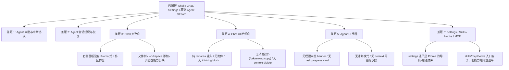

# j-gui 相对 Proma 的当前差距

## 速答

**j-gui 已经跨过"能不能跑起来"的阶段，但还没到 Proma 那种可持续工作的 Agent 工作台。** 当前基础壳、Chat 闭环、配置与基础 Agent 流式输出都已经具备；并且这次补完后，**会话切换串台、搜索只切 session id、标题回落到 session id** 这些明显的运行问题也已经收敛。

真正还没追平的差距主要集中在下面几层：

1. **Agent 审批/中断协议**：当前只有 `assistantContent` / `toolUse` / `toolResult` / `done` / `error` 这类只读事件，没有 Proma 那种“继续 / 批准 / 拒绝 / 计划反馈”的完整回传链路。
2. **Agent 会话组织与恢复**：Agent 会话能落盘和切换，但还没有 Proma 那种完整的 session 组织、归档、恢复与检索体验。
3. **Shell 完整度**：右侧工作区面板、文件树、搜索内容命中、多标签细节仍然不完整。
4. **Chat UI 精细度**：输入框、消息气泡、流式渲染、上下文管理在功能上可用，但与 Proma 的 polished 体验差距明显。
5. **Agent UI**：工具调用展示、任务进度聚合、权限审批交互、计划模式、上下文用量指示器，这些 Proma 的 Agent UI 组件在 j-gui 中基本还是空白。
6. **Agent 治理面**：这次已经补上 `Skills / Hooks / MCP` 的设置页入口骨架，但 UI 交互和数据契约还远没到 Proma 水平；其中 `MCP` 仍只挂 Agent runtime，不扩写到当前 Chat 路径。

这意味着当前产品更接近 **"Chat 优先的桌面壳 + Agent 流式预览"**，而不是 **"Proma 风格的 Agent 工作台"**。

## 本次校准

这份 explore 已按当前代码状态回写，不再沿用旧快照里的运行问题判断：

- `src/components/app-shell/AppShell.tsx:167-181` 现在会把选中的会话切到或创建对应 tab，不再把 chat 会话硬塞进 agent tab。
- `src/components/chat/ChatView.tsx:115-122` 和 `src/components/agent/AgentView.tsx:399-406` 会用首条用户消息派生标题，避免再回落成纯 session id。
- `src/atoms/sessions.ts:55-115` 已把 chat / agent 的消息与流式状态按 tab 隔离。
- `src/components/settings/SettingsDialog.tsx:20-28`、`src/components/settings/SkillsTab.tsx:7-52`、`src/components/settings/HooksTab.tsx:24-84`、`src/components/settings/McpTab.tsx:9-77` 已把 Skills / Hooks / MCP 挂到设置页，但当前仍是治理列表，不是 Proma 级完整交互面。

## 关键证据

### 1. 会话切换串台这类运行问题已经收敛，但 Tab 工作区仍然是简化版

- `src/components/app-shell/AppShell.tsx:167-181` 现在会按 session 类型切到或创建对应 tab，不再把 chat 会话硬塞进 agent tab。
- `src/components/app-shell/MainArea.tsx:23-24` 仍然是单一壳层内的标签管理，不是 Proma 那种完整的 tab 工作台。
- `src/components/app-shell/MainArea.tsx:54-61` 现在只是按 tab 渲染内容，标签预览、拖拽重排、关闭确认的 Proma 细节仍未追平。

### 2. Agent 对话已能落盘和恢复，但治理与 UI 层还很粗

- `src/atoms/sessions.ts:55-101, 180-188` 已经把 chat/agent 消息与流式状态拆成按 tab 隔离的 map，并提供标题派生函数。
- `src/components/agent/AgentView.tsx:347-415` 发送 Agent 消息时会补写标题并调用 `sendAgentMessage`。
- `src-tauri/src/commands/agent.rs:7-35` 和 `src-tauri/src/agent_session.rs:93-241` 已经有 agent session 的创建、读取、删除和 transcript 维护。
- 这意味着“agent 模式发消息没有回应 / chat 串到 agent 里”的根因已经收敛，但离 Proma 那种完整会话组织、归档、恢复体验还差很多。

### 3. Agent 审批链路还没真正开始，当前只有只读流，没有 Proma 那种完整回传协议

- `src/lib/tauri.ts:133-150` 定义的 `AgentEvent` 只有 `assistantContent`、`toolUse`、`toolResult`、`done`、`error`。
- `src-tauri/src/commands/agent.rs:18-35` 只有发送消息和停止引擎，没有“批准 / 拒绝 / 继续计划”类命令。
- `src/components/agent/AgentView.tsx:51-130` 事件分发也只覆盖上述五类事件，没有任何 banner/interrupt 分支。
- 这说明当前 Tool Call 只是展示，不是 Proma 那种可交互的 Agent 审批流。

### 4. 右侧工作区面板还是半成品：默认关、无 Proma 式工作区入口、目录展开不读取子目录

- `src/atoms/sidebar.ts:3-4` 中 `rightPanelOpenAtom` 默认是 `false`。
- `src/components/app-shell/AppShell.tsx:66` 只有在 `rightPanelOpen` 为真时才渲染 `RightSidePanel`。
- `src/components/app-shell/RightSidePanel.tsx:15-18` 组件内部只拿到了“关闭”能力和一个固定 `cwd = "."`。
- `src/components/app-shell/RightSidePanel.tsx:20-33` 只在当前目录执行一次 `readDir`；`43-50` 的 `toggleDir` 只是切换展开状态，没有继续读取子目录内容。

### 5. 搜索闭环已补齐基础回填，但和 Proma 的内容搜索还差很远

- `src/components/app-shell/SearchDialog.tsx:44-88` 仍然只是标题/ID 搜索，没有消息内容命中、高亮片段和双路检索。
- `src/components/app-shell/AppShell.tsx:109-141` 会在加载会话后回填标题，避免历史会话还停留在 session id。
- `src/components/app-shell/AppShell.tsx:167-181` 现在会把选中的会话切到对应 tab，不再只定位 session id。

### 6. roadmap 里仍有大量 Proma gap 尚未追平

- `.codestable/roadmap/j-gui-desktop-app/j-gui-desktop-app-items.yaml` 里 `skills-ui`、`hooks-ui`、`mcp-config-ui`、`settings-refined`、`search-enhanced`、`sidebar-collapsible` 等条目仍只是“入口 / 骨架 / 局部补齐”，远没达到 Proma 的当前水平。
- 这次修复解决的是“会话切换 / Agent 发消息 / 标题回落”三个运行层问题，不代表 roadmap 里那些 UI gap 已经完成。

## 差距矩阵

| 差距项 | 当前现状 | 缺口类型 | Proma 实现经验 | j-gui 落地约束 | 首版级别 | roadmap |
|------|----------|----------|----------------|----------------|----------|---------|
| 多标签工作区 | 已能按 tab 切换 chat/agent，但仍是简化工作台 | 状态模型 + UI 壳层 | Proma 把 tab 身份、active 状态、预览、关闭确认、错误边界拆开处理；不是一个 `mode` 开关包打天下 | 继续补预览/拖拽/关闭确认/错误边界；别把“能切换”误当“追平” | P0 | `#9` `#28` |
| Agent 会话组织 | 已能落盘/恢复/按 tab 读取，但组织方式很简化 | 持久化协议 + 导航状态 | Proma 的 Agent 与 Chat 一样进入可搜索、可恢复、可切换的会话体系 | 继续补归档、恢复、搜索、列表治理；不要停在“能存” | P0 | `#32` `#33` |
| Agent 审批/中断链路 | 只有只读 `AgentEvent`，前端不能回传选择 | IPC 协议 | Proma 把 `permission / ask_user / plan` 当三种不同中断，不共用一个窄响应模型 | `AgentEvent::Interrupt` 与 `InterruptResponse` 必须按类型分型，不能只留 `approve/deny` | P0 | `#31` `#34` |
| 搜索闭环 | 已能切到正确会话并回填基础内容，但没有内容搜索 | 导航闭环 | Proma 的搜索不是“定位 id”，而是“真正打开目标上下文” | 继续做消息内容命中 / 高亮 / IME，不要把标题搜索当终点 | P1 | `#25` `#41` |
| 右侧工作区面板 | 只有顶层读取，默认关闭，无 Proma 式工作区体验 | 文件树状态 + 交互 | Proma 的 panel 是可打开的工作区容器，不只是静态目录列表 | 首版先补入口、递归懒加载、面包屑；重命名/拖放/脉冲点后置 | P1 | `#16` `#43` |
| Chat 输入模型 | 仍是纯 `textarea` + send button | 输入状态 + 消息模型 | Proma 的编辑器状态、附件状态、草稿状态、发送 payload 是分层的 | 先定“消息 payload 是否支持附件/引用/thinking”，再决定 TipTap 是否落地 | P1 | `#37` |
| Agent 任务进度与上下文工具 | 现在是逐条 tool call 平铺，没有聚合和上下文操作面板 | 展示聚合 + 可操作状态 | Proma 不是单纯渲染 tool_use，而是把 task/tool/context 三类信息做成不同组件 | 任务进度卡依赖明确的 tool 分类规则；Context badge 依赖真实 token 统计来源 | P1 | `#35` `#36` |
| Agent 配置治理（Skills / Hooks / MCP） | 已有设置页入口骨架，但离 Proma 的治理面还差很多 | 配置契约 + 设置 UI | Proma 给出 Settings 导航与 Skills/MCP 组织方式，j-cli TUI 已给出 Skills/Hooks 的启停语义与列表模型 | Skills/Hooks 复用 j-cli 现有 `disabled_*` 口径；MCP 只作用于 Agent runtime，不向当前 Chat 路径扩张 | P1 | `#44` `#45` `#46` `#47` `#48` |
| 共享消息基元 | Chat 与 Agent 各自临时拼装，缺统一 message/conversation/reasoning 抽象 | 组件边界 | Proma 先沉淀 `ai-elements`，再在 Chat/Agent 上复用 | 首版不需要完整复制组件库，但至少要先统一 Message/Conversation/Reasoning 三个基元边界 | P2 | `#38` `#39` |
| 设置重构 | 现有多 tab 已扩展，但还不是 Proma 的导航 + 原语 + 脏状态三层结构 | 表单状态 + UI 原语 | Proma 的设置页不是“一个大弹窗”，而是导航、原语、脏状态三层结构 | 先抽 `settings primitives` 和 `settingsTabAtom`，再继续扩 tab 数量 | P2 | `#42` |

## 结论

- **Proma 对齐已完成的部分**：三栏壳、Chat 主链路、Markdown 渲染、Provider/主题/别名设置、基础 Agent CLI 流式输出、会话切换修正、标题回填基础闭环。
- **Proma 对齐的核心缺口**：Agent 审批/中断协议、Proma 级别的会话组织与恢复、MainArea 多标签细节、Search 内容搜索闭环、RightSidePanel 工作区体验。
- **UI 精细度缺口**：Chat 输入框（富文本/附件/工具栏）、消息操作（fork/rewind/copy）、Agent UI 组件（权限审批/任务进度/计划模式/context 用量指示器）、设置对话框（多 tab 导航/专用 UI 原语/未保存保护）、共享 AI 元素库（Message/Conversation/Reasoning 等基元）。
- **对 roadmap 的直接影响**：现有 roadmap 不是“差不多了”，而是需要继续把剩余的 Proma gap 拆成明确子 feature，再按优先级一项项补完。

## 建议下一步

继续把 **Agent 中断协议**、**Agent UI 组件体系**、**Settings / Skills / Hooks / MCP 完整治理面** 拆成正式 roadmap 条目，然后按 Proma 的交互层级逐项补齐。
