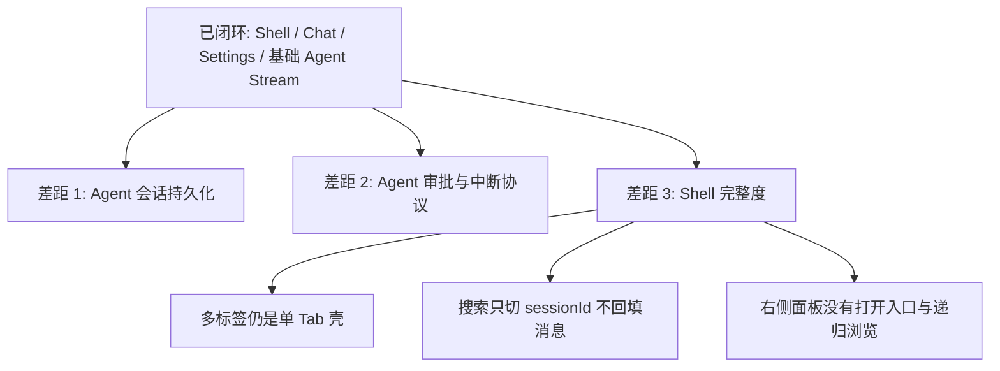

# j-gui 相对 Proma 的当前差距

## 速答

**j-gui 已经跨过“能不能跑起来”的阶段，但还没到 Proma 那种可持续工作的 Agent 工作台。** 当前基础壳、Chat 闭环、配置与基础 Agent 流式输出都已经具备，真正的差距集中在三层：

1. **Agent 会话模型**：现在的 Agent 对话还是内存态，不能像 Chat 那样进入会话列表、搜索、切换、恢复。
2. **Agent 中断/审批协议**：当前只有 `assistantContent` / `toolUse` / `toolResult` / `done` / `error` 这类只读事件，没有“继续 / 批准 / 拒绝”回传链路。
3. **Shell 完整度**：多标签、搜索后的消息回填、右侧工作区面板都还只是半闭环。

这意味着当前产品更接近 **“Chat 优先的桌面壳 + Agent 流式预览”**，而不是 **“Proma 风格的 Agent 工作台”**。roadmap 里有几项被高估为 `done`，同时还缺 2 个真正的核心条目：**Agent 中断协议** 和 **Agent 会话存储/导航**。

## 关键证据

1. **主区域仍是固定单 Tab，离 Proma 的标签工作区还有一段距离。**
   - `src/components/app-shell/MainArea.tsx:23-24` 把 `tabs` 固定为单个 `default` tab，`activeTabId` 也固定不变。
   - `src/components/app-shell/MainArea.tsx:54-61` 内容区只是按当前 `mode` 在同一个槽位里切 `ChatView` / `AgentView`。
   - 这说明当前只是“有 Tab 样子”，不是“有 Tab 能力”。

2. **Agent 对话仍是纯内存态，没有进入会话系统。**
   - `src/atoms/sessions.ts:29-33` 只定义了 `agentMessagesAtom` / `agentStreamingAtom`，没有 Agent 会话列表或持久化索引。
   - `src/components/agent/AgentView.tsx:167-189` 发送 Agent 消息时只往 `agentMessagesAtom` 追加，没有 session id、没有持久化调用。
   - `src/components/app-shell/LeftSidebar.tsx:78-108` 新建/切换会话逻辑全部强制 `setMode("chat")`，并且只通过 `getSessionMessages()` 回填 Chat 消息。
   - `src/lib/tauri.ts:133-150` 与 `src-tauri/src/commands/agent.rs:7-35` 只暴露 `start_agent` / `send_agent_message` / `stop_agent`，没有 list/get/delete/resume 这类 Agent 会话接口。

3. **Agent 审批链路还没真正开始，当前只有只读流，没有回传协议。**
   - `src/lib/tauri.ts:133-150` 定义的 `AgentEvent` 只有 `assistantContent`、`toolUse`、`toolResult`、`done`、`error`。
   - `src-tauri/src/commands/agent.rs:18-35` 只有发送消息和停止引擎，没有“批准 / 拒绝 / 继续计划”类命令。
   - `src/components/agent/AgentView.tsx:51-130` 事件分发也只覆盖上述五类事件，没有任何 banner/interrupt 分支。
   - 这说明当前 Tool Call 只是展示，不是 Proma 那种可交互的 Agent 审批流。

4. **右侧工作区面板还处于半成品：默认关、无打开入口、目录展开不读取子目录。**
   - `src/atoms/sidebar.ts:3-4` 中 `rightPanelOpenAtom` 默认是 `false`。
   - `src/components/app-shell/AppShell.tsx:66` 只有在 `rightPanelOpen` 为真时才渲染 `RightSidePanel`。
   - `src/components/app-shell/RightSidePanel.tsx:15-18` 组件内部只拿到了“关闭”能力和一个固定 `cwd = "."`。
   - `src/components/app-shell/RightSidePanel.tsx:20-33` 只在当前目录执行一次 `readDir`；`43-50` 的 `toggleDir` 只是切换展开状态，没有继续读取子目录内容。

5. **搜索弹窗能选会话，但不会把会话内容 hydrate 回当前界面。**
   - `src/components/app-shell/SearchDialog.tsx:44-46` 与 `86-88` 选中结果时只执行 `onSelect(id)`。
   - `src/components/app-shell/AppShell.tsx:54-56` 的 `handleSelectSession` 也只是 `setSessionId(id)`，没有像左侧栏那样调用 `getSessionMessages()`。
   - 这意味着搜索只完成了“定位 session id”，没有完成“打开这段对话”。

6. **roadmap 机器清单对几项能力的完成度判断偏乐观。**
   - `.codestable/roadmap/j-gui-desktop-app/j-gui-desktop-app-items.yaml:69-75` 把 `frontend-main-area` 标成 `done`，但代码仍是固定单 tab。
   - `.codestable/roadmap/j-gui-desktop-app/j-gui-desktop-app-items.yaml:117-131` 把 `frontend-permission`、`frontend-right-panel` 标成 `done`，但前者没有命令协议，后者没有打开入口和递归树。
   - `.codestable/roadmap/j-gui-desktop-app/j-gui-desktop-app-items.yaml:197-235` 把 `frontend-search`、`frontend-tabs-enhanced` 标成 `done`，但当前分别缺消息回填和多标签增强主体。

## 结论

- **Proma 对齐已完成的部分**：三栏壳、Chat 主链路、Markdown 渲染、Provider/主题/别名设置、基础 Agent CLI 流式输出。
- **Proma 对齐的核心缺口**：Agent 会话系统、Agent 审批/中断协议、MainArea 多标签、Search 真正打开对话、RightSidePanel 真正接入工作区。
- **对 roadmap 的直接影响**：现有 roadmap 应该先校正 5 个条目的状态，再新增 2-3 个面向 Agent 生命周期的条目，而不是继续把“Agent 已完成”当成既成事实。

## 建议下一步

基于这份 explore，先更新 `j-gui-desktop-app-items.yaml` 的状态口径，再把 **Agent 中断协议** 和 **Agent 会话存储/导航** 升级成正式 roadmap 条目。
