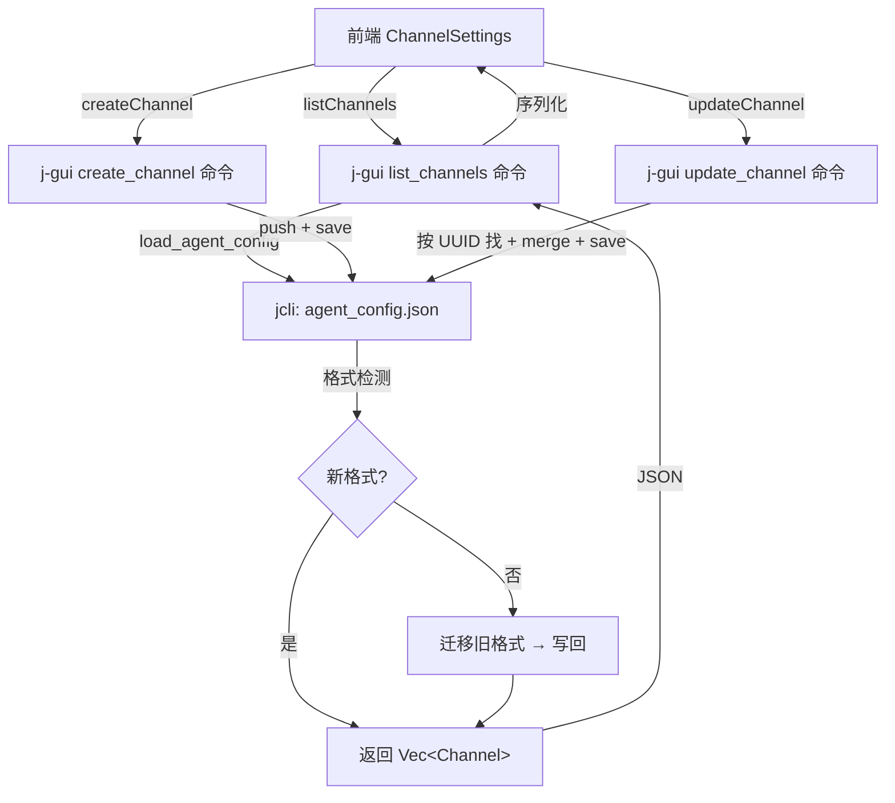

# channel-model-unify — 统一前后端 Channel 数据模型

## 0. 术语

| 术语 | 含义 | 现名 |
|------|------|------|
| **Channel** | 渠道配置实体 | 前端 `Channel`，后端 `ModelProvider`（j-cli）|
| **ProviderType** | 供应商枚举 | `'anthropic' \| 'openai' \| 'deepseek' \| ...` |
| **ChannelModel** | 渠道下的单个模型 | `{ id, name, enabled }` |
| **agent_config.json** | j-cli 全局配置 | `~/.jdata/agent/data/agent_config.json` |

> 本次统一后，前后端均使用 `Channel` 作为统一类型名，废弃 `ModelProvider`（j-cli）和 `ChannelInfo`（j-gui 后端）。

## 1. 决策与约束

### 1.1 为什么不新建 channels.json

选项 A：j-gui 单独维护 `channels.json`，与 j-cli `agent_config.json` 并存。
选项 B：扩展 j-cli `ModelProvider` 结构，仍存储在 `agent_config.json`。

**决策：选 B**。理由：
- Channel 的底层用途就是 j-cli 的 provider 配置，两份文件会给"哪个是真实来源"制造歧义
- j-cli Chat/Agent 链路已经消费 `agent_config.json.providers`，独立文件需要额外同步
- 格式升级向后兼容：旧 `ModelProvider` 字段都在，新增字段有默认值，旧配置文件读取不报错

### 1.2 明确不做

- 不改变 j-cli Chat 调用链路（仍通过 `active_index` 选 provider）
- 不在 j-gui 内实现 provider 安装向导或 marketplace
- 不碰 Agent 渠道选择逻辑（已有 `agentChannelIdsAtom`）
- API Key 加密仅做 base64 混淆（非密钥派生，j-cli 调用链路需要明文）

### 1.3 涉及仓库

- `jcli`（`E:\Coding\AI\jcli`）：`ModelProvider` 结构升级 + `agent_config.json` 格式兼容迁移
- `j-gui`（`E:\Coding\AI\j-gui`）：后端命令输出对齐 + 前端 IPC 适配

## 2. 方案

### 2.1 名词层

**现状**（j-cli `ModelProvider`）：

```rust
// jcli/src/command/chat/storage/config.rs
pub struct ModelProvider {
    pub name: String,           // e.g. "My Anthropic"
    pub api_base: String,       // e.g. "https://api.anthropic.com"
    pub api_key: String,        // 明文
    pub model: String,          // 单个模型 ID
    pub supports_vision: bool,
}
// providers: Vec<ModelProvider>, id = 数组下标
```

**现状**（j-gui 后端 `ChannelInfo`）：

```rust
// j-gui/src-tauri/src/commands/channels.rs
pub struct ChannelInfo {
    pub id: usize,              // 数组下标，不是稳定标识
    pub name: String,
    pub provider: String,       // 从 api_base URL 推断，不准确
    pub api_base: String,
    pub models: Vec<String>,    // 仅模型 ID 字符串
}
```

**现状**（前端 `Channel`）：

```typescript
// packages/shared/src/types/channel.ts
interface Channel {
  id: string           // UUID
  name: string
  provider: ProviderType
  baseUrl: string
  apiKey: string       // 加密（base64）
  models: ChannelModel[]
  enabled: boolean
  createdAt: number
  updatedAt: number
}
```

---

**变化**（统一后的 `Channel`）：

```rust
// jcli: 扩展 ModelProvider → 重命名为 Channel
#[derive(Clone, Serialize, Deserialize)]
#[serde(rename_all = "camelCase")]
pub struct Channel {
    pub id: String,                   // UUID v4，稳定标识
    pub name: String,
    pub provider: String,             // 显式字段："anthropic" | "openai" | ...
    pub api_base: String,
    pub api_key: String,              // 明文（j-cli 调用需要），传输时 base64 混淆
    pub models: Vec<ChannelModel>,    // [ { id, name, enabled } ]
    pub enabled: bool,                // 默认 true
    pub supports_vision: bool,
    pub created_at: u64,              // unix timestamp millis
    pub updated_at: u64,
}

#[derive(Clone, Serialize, Deserialize)]
#[serde(rename_all = "camelCase")]
pub struct ChannelModel {
    pub id: String,
    pub name: String,
    pub enabled: bool,
}
```

**agent_config.json 格式升级**：

```jsonc
// 旧格式 → 新格式（自动迁移）
{
  "providers": [
    // 旧: { "name": "x", "api_base": "https://...", "api_key": "sk-...", "model": "gpt-4", "supports_vision": false }
    // 新: { "id": "uuid", "name": "x", "provider": "openai", "api_base": "https://...", "api_key": "sk-...", "models": [{"id":"gpt-4","name":"GPT-4","enabled":true}], "enabled": true, "supports_vision": false, "createdAt": 1700000000000, "updatedAt": 1700000000000 }
  ]
}
```

**迁移逻辑**（jcli 侧 `load_agent_config()`）：
1. 读取 `agent_config.json` → 检查 `providers` 数组首个元素的格式
2. 若含 `id` 字段且为 UUID 格式 → 已是新格式，直接反序列化
3. 否则 → 逐条迁移：生成 UUID、`model` 字符串转为 `models[0]`、`provider` 从 `api_base` 推断、补默认时间戳
4. 写回 `agent_config.json`（自动升级）

### 2.2 编排层

**主流程**：



**Channel CRUD 命令**（j-gui `commands/channels.rs`，替换现有实现）：

```
list_channels() → Vec<Channel>
create_channel(input: CreateChannelInput) → Channel
  // input: { name, provider, apiBase, apiKey, model?, supportsVision? }
  // 生成 UUID，models 初始为单条（如果有 model），createdAt/updatedAt = now
update_channel(input: UpdateChannelInput) → Channel
  // input: { id, name?, provider?, apiBase?, apiKey?, models?, enabled?, supportsVision? }
  // 按 UUID 查找，merge 非 null 字段，apiKey 含 "..." 则保留旧值
delete_channel(id: String) → ()
  // 按 UUID 查找并移除，调整 active_index
test_channel_direct(input: TestChannelInput) → TestChannelResult  // 不变
fetch_models(apiBase, apiKey) → FetchModelsResult                 // 不变
```

**前端 IPC 对齐**：
- `listChannels()` → `invoke('list_channels')` → 直接返回 `Channel[]`，无需转换
- `createChannel(input)` → `invoke('create_channel', { input })` — 用后端字段名（`apiBase` 非 `baseUrl`）
- `ChannelSettings` 中删除"从 ChannelInfo 推断 provider"的兼容代码

### 2.3 挂载点

| # | 挂载点 | 说明 |
|---|--------|------|
| 1 | jcli `ModelProvider` → `Channel` | jcli 数据结构定义 |
| 2 | jcli `load_agent_config()` | 格式检测 + 迁移逻辑 |
| 3 | j-gui `commands/channels.rs` | CRUD 命令实现（id 类型 + 返回结构变更） |
| 4 | j-gui `lib.rs` | 命令注册（不变，命令名不变） |
| 5 | 前端 `ipc.ts` | IPC 封装（去 adapter 层） |
| 6 | 前端 `ChannelSettings` / `ChannelForm` | 去兼容代码 |

### 2.4 推进策略（按 paradigm 维度切片）

| Step | Paradigm | 内容 | 退出信号 |
|------|----------|------|---------|
| 1 | 数据模型 | jcli: 扩展 `ModelProvider` → `Channel`，含迁移逻辑 + 单元测试 | `cargo test -p j-cli` 通过 |
| 2 | 后端命令 | j-gui: 重写 channels.rs CRUD（UUID id，Channel 返回结构）+ 测试 | `cargo test` channels 模块通过 |
| 3 | 前端适配 | j-gui: IPC 封装对齐 + ChannelSettings/ChannelForm 去兼容代码 + 测试 | `bun run test` 通过 |
| 4 | 端到端验证 | 启动应用，创建/编辑/删除渠道，验证持久化 | 渠道 CRUD 端到端可用 |

### 2.5 结构健康度与微重构

**要改的文件**：
- `jcli/src/command/chat/storage/config.rs` — ModelProvider 定义（~50 行相关），改动集中，文件健康 ✅
- `j-gui/src-tauri/src/commands/channels.rs` — 重写 CRUD（~200 行），改动集中 ✅
- `j-gui/src/components/settings/ChannelForm.tsx` — 去兼容逻辑（~10 行改动）✅
- `j-gui/src/components/settings/ChannelSettings.tsx` — 去兼容逻辑 ✅

**结论：本次不做微重构**。改动集中在数据结构定义和 CRUD 实现，不涉及文件拆分或目录重组。

## 3. 验收契约

### 正常场景

| # | 触发 | 期望结果 |
|---|------|---------|
| A1 | 首次启动（旧格式 agent_config.json） | 自动迁移为新格式，旧 provider 显示正确（UUID id、provider 类型、models 数组） |
| A2 | 创建渠道（填写 DeepSeek 预设） | 渠道出现在列表，名称/URL/models 正确，API Key 加密存储 |
| A3 | 编辑渠道 | 修改保存后刷新列表，字段更新正确 |
| A4 | 删除渠道 | 渠道从列表移除，active_index 自动调整 |
| A5 | 切换选中渠道 | ModelSelector 正确切换，Chat 使用选中渠道 |
| A6 | 测试连接（DeepSeek Anthropic 端点） | 连接测试通过（/messages 端点 + Bearer auth） |

### 边界场景

| # | 触发 | 期望结果 |
|---|------|---------|
| B1 | 旧 providers 数组为空 | 无迁移，启动正常 |
| B2 | 旧 provider 无 model 字段 | models 初始化为空数组，UI 提示"未配置模型" |
| B3 | 创建渠道时未填名称 | 前端 toast 提示"请输入配置名称" |
| B4 | 编辑渠道传已脱敏 API Key（含 "..."） | 后端保留旧 API Key |

### 错误场景

| # | 触发 | 期望结果 |
|---|------|---------|
| C1 | agent_config.json 损坏 | 返回默认空配置，不崩溃 |
| C2 | 删除不存在的 UUID | 后端返回错误，前端 toast 提示 |
| C3 | 更新不存在的 UUID | 后端返回错误 |

### 明确不做反向核对

- [ ] 不引入新的配置文件（仍用 agent_config.json）
- [ ] 不改变 Chat 调用链路的 provider 选择逻辑
- [ ] 不改变 Agent 渠道选择逻辑
- [ ] API Key 不引入密钥派生（保持 j-cli 调用兼容）

## 4. 对其他模块的影响

| 模块 | 影响 | 动作 |
|------|------|------|
| jcli `chat_engine` | `load_agent_config().providers` 结构变化 | 适配 `model` 字段迁移到 `models[0].id` |
| jcli Agent 链路 | 同上 | 适配 |
| j-gui `ChatEngine` | 同上 | 适配 |
| j-gui `AgentEngine` | 同上 | 适配 |
| 前端 `ModelSelector` | `Channel` 类型变化 | `baseUrl` → `apiBase`（IPC 层自动映射） |
