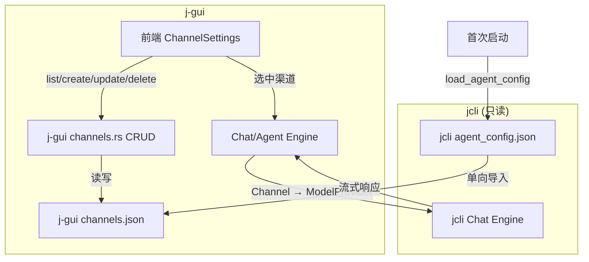

> **前置依赖**：`2026-05-10-kernel-trait-abstraction` (#30)。本 feature 基于 `ConfigKernel` trait 实现，不再直接导入 jcli 内部模块。

# channel-model-unify — j-gui 自建 Channel 模型，解耦 jcli

## 0. 术语

| 术语 | 含义 |
|------|------|
| **Channel** | j-gui 自有渠道配置实体，存储在 `channels.json` |
| **ModelProvider** | jcli 的 provider 结构 `{ name, api_base, api_key, model, supports_vision }`，j-gui 只读不写 |
| **单向导入** | 首次启动：jcli providers → j-gui channels（一次性，jcli 源不删） |
| **调用时映射** | Chat/Agent 需要时：Channel → 临时 ModelProvider |

> 架构约束见 `.codestable/compound/2026-05-10-decision-jgui-jcli-decouple.md`。

## 1. 决策与约束

### 1.1 核心约束

- **j-gui 不修改 jcli 代码**——jcli 由独立仓库/团队维护
- **j-gui 自有存储**：`~/.jgui/channels.json`，不复用 jcli `agent_config.json`
- **单向数据流**：jcli → j-gui（导入），j-gui → jcli（调用时映射），j-gui ↛ jcli（不写回）

### 1.2 明确不做

- 不修改 jcli `ModelProvider` 结构
- 不写入 jcli `agent_config.json`
- 不引入 WS/HTTP 远程协议（仍通过 crate path dependency 直接调用）
- API Key 加密仅 base64 混淆（jcli 调用需要明文）
- 首次导入后不自动同步 jcli 变更（用户手动触发"从 jcli 刷新"）

## 2. 方案

### 2.1 名词层

**现状**（j-gui 直接操作 jcli 的 `ModelProvider`）：

```rust
// jcli — j-gui 不应修改此结构
pub struct ModelProvider {
    pub name: String,
    pub api_base: String,
    pub api_key: String,
    pub model: String,           // 单字符串
    pub supports_vision: bool,
}
```

**现状**（前端 `Channel` 类型）：

```typescript
// packages/shared/src/types/channel.ts
interface Channel {
  id: string           // UUID
  name: string
  provider: ProviderType
  baseUrl: string
  apiKey: string       // base64 混淆
  models: ChannelModel[]
  enabled: boolean
  createdAt: number
  updatedAt: number
}
```

---

**变化**（j-gui 自建 Channel 存储）：

```rust
// j-gui: src-tauri/src/commands/channels.rs — 数据模型

#[derive(Clone, Serialize, Deserialize)]
#[serde(rename_all = "camelCase")]
pub struct Channel {
    pub id: String,                   // UUID v4
    pub name: String,
    pub provider: String,             // "anthropic" | "openai" | "deepseek" | ...
    pub api_base: String,
    pub api_key: String,              // base64 混淆存储
    pub models: Vec<ChannelModel>,
    pub enabled: bool,
    pub supports_vision: bool,
    pub created_at: u64,              // unix timestamp millis
    pub updated_at: u64,
}

#[derive(Clone, Serialize, Deserialize)]
#[serde(rename_all = "camelCase")]
pub struct ChannelModel {
    pub id: String,
    pub name: String,
    pub enabled: bool,
}
```

**存储位置**：`~/.jgui/channels.json`

```json
{
  "version": 1,
  "channels": [
    {
      "id": "550e8400-e29b-41d4-a716-446655440000",
      "name": "DeepSeek",
      "provider": "deepseek",
      "apiBase": "https://api.deepseek.com/anthropic",
      "apiKey": "c2st...base64...",
      "models": [
        { "id": "deepseek-v4-pro", "name": "DeepSeek V4 Pro", "enabled": true }
      ],
      "enabled": true,
      "supportsVision": false,
      "createdAt": 1715340000000,
      "updatedAt": 1715340000000
    }
  ]
}
```

**首次导入**（jcli `agent_config.json` → j-gui `channels.json`）：

```rust
fn import_from_jcli() -> Vec<Channel> {
    // 1. 读 jcli agent_config.json（只读）
    let config = j_cli::command::chat::storage::load_agent_config();
    // 2. 遍历 providers，逐条映射为 Channel
    config.providers.iter().enumerate().map(|(i, p)| Channel {
        id: Uuid::new_v4().to_string(),
        name: p.name.clone(),
        provider: infer_provider(&p.api_base),  // 从 URL 推断
        api_base: p.api_base.clone(),
        api_key: base64_encode(&p.api_key),
        models: vec![ChannelModel {
            id: p.model.clone(),
            name: p.model.clone(),
            enabled: true,
        }],
        enabled: i == config.active_index,
        supports_vision: p.supports_vision,
        created_at: now_ms(),
        updated_at: now_ms(),
    }).collect()
}
```

**调用时映射**（Channel → ModelProvider）：

```rust
fn channel_to_provider(ch: &Channel) -> ModelProvider {
    let default_model = ch.models.iter()
        .find(|m| m.enabled)
        .map(|m| m.id.clone())
        .unwrap_or_default();
    ModelProvider {
        name: ch.name.clone(),
        api_base: ch.api_base.clone(),
        api_key: base64_decode(&ch.api_key),
        model: default_model,
        supports_vision: ch.supports_vision,
    }
}
```

### 2.2 编排层



**Channel CRUD 命令**（替换现有 channels.rs 实现）：

```
list_channels() → Vec<Channel>
  // 读 channels.json，不存在则触发首次导入

create_channel(input: CreateChannelInput) → Channel
  // 生成 UUID，补时间戳，API Key base64 编码

update_channel(id: String, input: UpdateChannelInput) → Channel
  // 按 UUID 查找，merge 非 null 字段，apiKey 含 "..." 则留旧值

delete_channel(id: String) → ()

test_channel_direct(input: TestChannelInput) → TestChannelResult
  // 不变

fetch_models(apiBase: String, apiKey: String) → FetchModelsResult
  // 不变
```

### 2.3 挂载点

| # | 挂载点 | 说明 |
|---|--------|------|
| 1 | `src-tauri/src/commands/channels.rs` | Channel 数据模型 + CRUD + 首次导入 + 映射函数 |
| 2 | `~/.jgui/channels.json` | j-gui 自有 Channel 存储 |
| 3 | `src-tauri/src/chat_engine.rs` | 调用时 `channel_to_provider()` 映射 |
| 4 | `src-tauri/src/agent_engine.rs` | 同上（Agent 链路）|
| 5 | 前端 `ipc.ts` / `ChannelSettings` | IPC 封装对齐 + 去兼容代码 |

### 2.4 推进策略

| Step | Paradigm | 内容 | 退出信号 |
|------|----------|------|---------|
| 1 | 数据模型 | j-gui: Channel 结构定义 + channels.json 读写 + 首次导入逻辑 + 单元测试 | `cargo test` channels 模块通过 |
| 2 | 映射函数 | `channel_to_provider()` + Chat/Agent Engine 适配 + 测试 | chat_engine 测试通过 |
| 3 | 后端命令 | 重写 channels.rs CRUD（自有存储 + UUID id + API Key 编码）| `cargo test` 全量通过 |
| 4 | 前端适配 | IPC 封装对齐 + ChannelSettings/ChannelForm 去兼容代码 + 测试 | `bun run test` 通过 |
| 5 | 端到端 | 创建渠道 → 选中 → Chat 发送消息 → 验证流式响应 | 端到端可用 |

### 2.5 结构健康度

- `channels.rs` 重写（~300 行），改动集中，文件健康 ✅
- 新增 `channels.json` 存储逻辑，各函数单一职责 ✅
- 本次不做微重构

## 3. 验收契约

### 正常场景

| # | 触发 | 期望结果 |
|---|------|---------|
| A1 | 首次启动（jcli 有旧 provider） | 自动导入到 channels.json，列表显示正确 |
| A2 | 首次启动（jcli 无 provider） | channels.json 为空，列表为空 |
| A3 | 创建渠道（DeepSeek 预设） | UUID 生成，API Key base64 编码存储，列表正确显示 |
| A4 | 编辑渠道 | 按 UUID 更新，apiKey 含 "..." 保留旧值 |
| A5 | 删除渠道 | 从 channels.json 移除 |
| A6 | 选中渠道 → Chat 发消息 | `channel_to_provider()` 正确映射，消息发送成功 |

### 边界场景

| # | 触发 | 期望结果 |
|---|------|---------|
| B1 | channels.json 不存在 | 触发首次导入 |
| B2 | channels.json 损坏 | 返回空列表，不崩溃 |
| B3 | 渠道无启用模型 | `channel_to_provider()` 返回空 model 字符串 |

### 错误场景

| # | 触发 | 期望结果 |
|---|------|---------|
| C1 | 删除不存在的 UUID | 后端返回错误 |
| C2 | 更新不存在的 UUID | 后端返回错误 |

### 明确不做反向核对

- [ ] 不修改 jcli `ModelProvider` 结构
- [ ] 不写入 jcli `agent_config.json`
- [ ] 不引入新的 IPC 协议
- [ ] API Key 不引入密钥派生

## 4. 对其他模块的影响

| 模块 | 影响 | 动作 |
|------|------|------|
| `chat_engine.rs` | 从读 `agent_config.json` 变为读 `channels.json` + `channel_to_provider()` | 适配 |
| `agent_engine.rs` | 同上 | 适配 |
| `config.rs` `get_agent_config` | 不再返回 jcli providers | 改为返回 j-gui channels |
| 前端 `ModelSelector` | `Channel` 类型已对齐 | 去兼容代码 |
