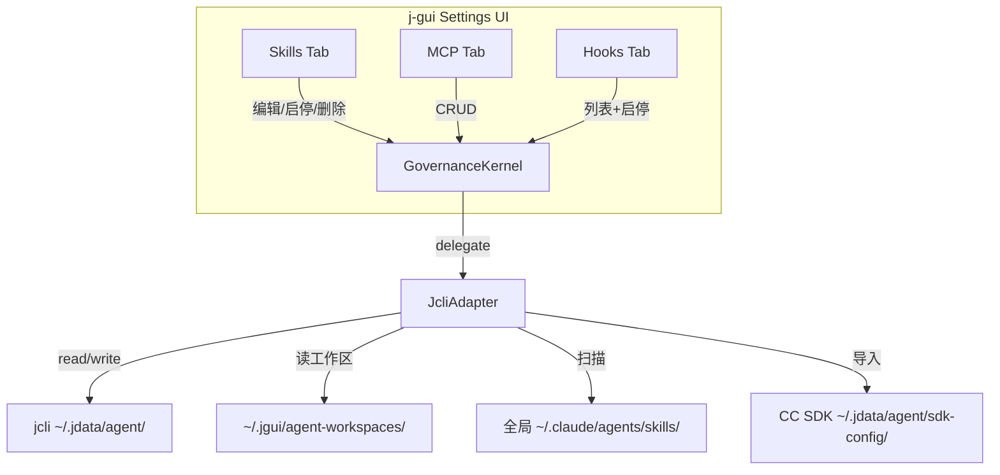

> **前置依赖**：`2026-05-10-kernel-trait-abstraction` (#30，已完成)。基于 `GovernanceKernel` trait 实现。

# governance-bidirectional-sync — 治理命令补全 + jcli 配置管理 UI

## 0. 术语

| 术语 | 含义 |
|------|------|
| jcli 源 | jcli 自身的 Skills/MCP/Hooks 存储（`~/.jdata/agent/`），j-gui 管理 |
| CC SDK 源 | Claude Code Agent SDK 的 Skills/MCP（`~/.jdata/agent/sdk-config/` + 工作区目录） |
| 全局源 | `~/.claude/agents/skills/` / `~/.agent/skills/`（npx 安装），j-gui 扫描 + 导入 |
| 工作区 | `~/.jgui/agent-workspaces/{slug}/` 下的 skills/ 和 mcp.json |

## 1. 决策与约束

### 1.1 核心约束

- **j-gui 管理 jcli 配置**——Skills/MCP/Hooks 的启停/编辑通过 j-gui UI 完成，写入 jcli 数据目录
- **CC SDK 源可导入**——从用户本地 Claude Code CLI 导入 Agent SDK 配置
- **UI 区分来源**——jcli 源 / CC SDK 源 / 全局源，在前端用不同标签展示
- **基于 GovernanceKernel**——所有治理操作通过 trait，不直接调 jcli

### 1.2 明确不做

- 不修改 jcli 代码
- 不在 j-gui 内创建/编辑 Hook 文件（仅启停）
- 不实现 MCP Server 安装向导

## 2. 方案

### 2.1 名词层

**现状**（Frontend IPC 调用无后端注册）：

```
ipc.writeSkillContent()      → invoke 'write_skill_content'     → ❌ 命令未注册
ipc.toggleWorkspaceSkill()   → invoke 'toggle_workspace_skill'   → ❌ 命令未注册
ipc.deleteWorkspaceSkill()   → invoke 'delete_workspace_skill'   → ❌ 命令未注册
ipc.saveWorkspaceMcpConfig() → invoke 'save_workspace_mcp_config'→ ❌ 命令未注册
ipc.getWorkspaceMcpConfig()  → invoke 'get_workspace_mcp_config' → ❌ fallback {}
```

**变化**（GovernanceKernel 新增方法 + 后端命令注册）：

```rust
// kernel/governance.rs — trait 扩展
pub trait GovernanceKernel: Send + Sync {
    // existing methods: list_skills, scan_global_skills, copy_skill_to_workspace,
    //                   list_hooks, toggle_hook, list_mcp_servers, save_mcp_servers,
    //                   list_chat_tools, set_tool_enabled

    // === Skills workspace management ===
    fn read_skill_content(&self, workspace_slug: &str, skill_slug: &str) -> Result<String, KernelError>;
    fn write_skill_content(&self, workspace_slug: &str, skill_slug: &str, content: &str) -> Result<(), KernelError>;
    fn toggle_workspace_skill(&self, workspace_slug: &str, skill_slug: &str, enabled: bool) -> Result<(), KernelError>;
    fn delete_workspace_skill(&self, workspace_slug: &str, skill_slug: &str) -> Result<(), KernelError>;
    fn get_workspace_skills(&self, workspace_slug: &str) -> Result<Vec<KernelSkillInfo>, KernelError>;
    fn get_workspace_skills_dir(&self, workspace_slug: &str) -> Result<String, KernelError>;
    fn get_other_workspace_skills(&self, workspace_slug: &str) -> Result<Vec<KernelSkillInfo>, KernelError>;
    fn import_skill_from_workspace(&self, from_slug: &str, to_slug: &str, skill_slug: &str) -> Result<(), KernelError>;

    // === MCP workspace management ===
    fn get_workspace_mcp_config(&self, workspace_slug: &str) -> Result<KernelMcpWorkspaceConfig, KernelError>;
    fn save_workspace_mcp_config(&self, workspace_slug: &str, config: &KernelMcpWorkspaceConfig) -> Result<(), KernelError>;

    // === Hooks management ===
    fn toggle_hook(&self, unique_id: &str, enabled: bool) -> Result<(), KernelError>;  // 已有骨架，需实现

    // === CC SDK import ===
    fn import_cc_sdk_hooks(&self) -> Result<Vec<KernelHookInfo>, KernelError>;
    fn import_cc_sdk_mcp(&self, workspace_slug: &str) -> Result<Vec<KernelMcpServerConfig>, KernelError>;
}
```

**Hooks UI 类型扩展**：

```typescript
// 前端 HookInfo 扩展（已有 enabled 字段）
interface HookInfo {
  name?: string; event: string; source: string; hook_type: string;
  label: string; timeout?: number; on_error?: string; unique_id: string;
  enabled: boolean;  // NEW — 从 jcli disabled_hooks 读取
}
```

### 2.2 编排层



**Hooks toggle 写入流**：

```
UI 切换 Hook 开关
  → invoke 'toggle_hook' (unique_id, enabled)
  → JcliAdapter::toggle_hook()
  → 读 jcli agent_config.json
  → 修改 disabled_hooks 列表
  → 写回 agent_config.json
  → CLI 用户立即看到变更
```

### 2.3 挂载点

| # | 挂载点 | 说明 |
|---|--------|------|
| 1 | `kernel/governance.rs` | GovernanceKernel trait 新增 ~15 方法 |
| 2 | `kernel/adapter.rs` | JcliAdapter 实现新方法 |
| 3 | `commands/governance.rs` | 注册新 Tauri 命令 |
| 4 | `src/lib.rs` | 注册新命令到 invoke_handler |
| 5 | 前端 `HooksSettings.tsx` | 增加启停开关 + 来源筛选 UI |

### 2.4 推进策略

| Step | 内容 | 退出信号 |
|------|------|---------|
| 1 | GovernanceKernel trait 新增 15 方法签名 | cargo check 通过 |
| 2 | JcliAdapter 实现所有新方法 | cargo test 全量通过 |
| 3 | 注册新 Tauri 命令（commands/governance.rs + lib.rs） | cargo check 通过 |
| 4 | HooksSettings UI 升级（启停开关 + 来源筛选） | bun run test 通过 |
| 5 | AgentSettings Skills/MCP tab 持久化验证 | 编辑后刷新不丢失 |

### 2.5 结构健康度

- `kernel/governance.rs` trait 扩展 ~50 行 ✅
- `kernel/adapter.rs` 新增 impl ~200 行 ✅
- `commands/governance.rs` 新增命令注册 ~30 行 ✅
- `HooksSettings.tsx` UI 升级 ~40 行 ✅
- 本次不做微重构

## 3. 验收契约

### 正常场景

| # | 触发 | 期望结果 |
|---|------|---------|
| A1 | Skills tab 编辑内容 → 保存 | 内容持久化，重启后保留 |
| A2 | Skills tab 启停切换 | 写入 jcli disabled_skills |
| A3 | MCP tab 添加/编辑/删除 server | 持久化到 mcp_config.json |
| A4 | Hooks tab 切换启停 | 写入 jcli disabled_hooks，CLI 侧同步 |
| A5 | 导入 CC SDK 配置 | Skills/MCP/Hooks 列表增加 CC SDK 源条目 |

### 边界场景

| # | 触发 | 期望结果 |
|---|------|---------|
| B1 | 工作区不存在 skills 目录 | 返回空列表 |
| B2 | Hook unique_id 不存在 | toggle_hook 返回错误 |

### 明确不做反向核对

- [ ] 不修改 jcli 代码
- [ ] 不在 j-gui 创建/编辑 Hook 文件
- [ ] 不实现 MCP 安装向导

## 4. 对其他模块的影响

| 模块 | 影响 | 动作 |
|------|------|------|
| `kernel/governance.rs` | trait +15 方法 | 扩展 |
| `kernel/adapter.rs` | 新方法 impl | 扩展 |
| `commands/governance.rs` | 新命令注册 | 扩展 |
| `src/lib.rs` | invoke_handler 增加 | 扩展 |
| `HooksSettings.tsx` | 启停开关 UI | 升级 |
| `AgentSettings.tsx` | Skills/MCP tab 持久化验证 | 无代码改动 |
