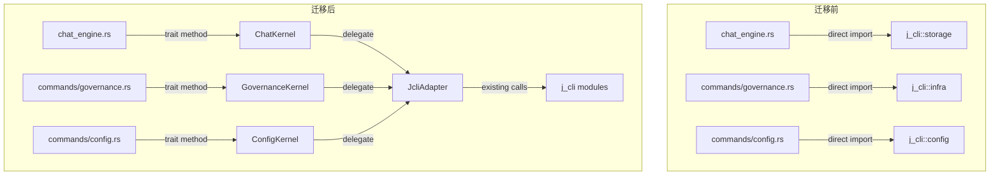

# kernel-trait-abstraction — jcli 内核 trait 抽象层

## 0. 术语

| 术语 | 含义 |
|------|------|
| **Kernel trait** | j-gui 定义的 Rust trait，抽象 jcli 的某一领域能力 |
| **Adapter** | 实现 trait 的结构体，内部包装现有 jcli 调用 |
| **迁移** | 将 j-gui 模块中的直接 `j_cli::` 导入替换为 trait 方法调用 |
| **退出标准** | `grep -r "j_cli::" src-tauri/src/` 仅命中 `adapters/` 目录 |

## 1. 决策与约束

### 1.1 为什么现在做

当前 22 个 `j_cli::` 导入点跨越 10 个内部模块。每新增一个 feature，解耦成本翻倍——#27 channel-model-unify、#28 governance-bidirectional-sync、#29 agent-engine-jagent 如果全基于直接导入实现，后续抽离需要同时改 5+ 个功能模块。

### 1.2 不做什么

- **不修改 jcli 代码**——trait 和 adapter 全在 j-gui 侧
- **不改变现有行为**——adapter 是纯包装，语义完全等价
- **不引入新的 IPC 协议**——仍通过 crate dependency 调用
- **不一步到位全部迁移**——分步：定义 trait → 写 adapter → 渐进迁移

## 2. 方案

### 2.1 名词层

**现状**（j-gui 直接导入 jcli 内部路径）：

```rust
// chat_engine.rs
use j_cli::command::chat::storage::{
    load_agent_config, ChatMessage, MessageRole, SessionEvent,
    append_session_event, load_session,
};
use j_cli::command::chat::agent::api::call_llm_stream_async;

// commands/governance.rs
use j_cli::command::chat::infra::skill::{load_all_skills, Skill, SkillSource};
use j_cli::command::chat::infra::hook::manager::HookManager;
use j_cli::command::chat::infra::hook::types::{HookEvent, OnError};

// commands/config.rs
use j_cli::config::YamlConfig;
use j_cli::command::chat::storage::{load_agent_config, save_agent_config, ModelProvider};
// ... 共 22 个导入点
```

---

**变化**（trait 抽象层）：

```rust
// src-tauri/src/kernel/mod.rs
pub mod chat;
pub mod config;
pub mod governance;
pub mod session;
pub mod system;

pub use chat::ChatKernel;
pub use config::ConfigKernel;
pub use governance::GovernanceKernel;
pub use session::SessionKernel;
pub use system::SystemKernel;
```

**Trait 定义**：

```rust
// kernel/chat.rs
#[async_trait]
pub trait ChatKernel: Send + Sync {
    /// 流式 LLM 调用。每次收到 chunk 调用 on_chunk。
    async fn stream_chat(
        &self,
        provider: &ModelProvider,       // 由上层从 Channel 映射
        messages: &[ChatMessage],
        system_prompt: Option<&str>,
        on_chunk: &mut dyn FnMut(&str),
    ) -> Result<(), String>;

    /// 发送消息并持久化到会话 transcript
    async fn send_message(
        &self,
        session_id: &str,
        messages: &[ChatMessage],
        system_prompt: Option<&str>,
        on_chunk: &mut dyn FnMut(&str),
    ) -> Result<(), String>;
}

// kernel/config.rs
pub trait ConfigKernel: Send + Sync {
    // Provider/Channel
    fn load_providers(&self) -> Vec<ModelProvider>;
    fn save_providers(&self, providers: &[ModelProvider]) -> Result<(), String>;

    // System Prompt
    fn load_system_prompt(&self) -> Option<String>;
    fn save_system_prompt(&self, prompt: &str) -> Result<(), String>;

    // YamlConfig
    fn get_yaml_section(&self, section: &str) -> HashMap<String, String>;
    fn set_yaml_property(&self, section: &str, key: &str, value: &str) -> Result<(), String>;
    fn remove_yaml_property(&self, section: &str, key: &str) -> Result<(), String>;
}

// kernel/governance.rs
pub trait GovernanceKernel: Send + Sync {
    // Skills
    fn list_skills(&self) -> Vec<SkillInfo>;
    fn scan_global_skills(&self) -> Vec<SkillInfo>;
    fn copy_skill_to_workspace(&self, source_dir: &str, workspace_slug: &str, skill_slug: &str) -> Result<(), String>;

    // Hooks
    fn list_hooks(&self) -> Vec<HookInfo>;
    fn toggle_hook(&self, unique_id: &str, enabled: bool) -> Result<(), String>;

    // MCP
    fn list_mcp_servers(&self) -> Vec<McpServerConfig>;
    fn save_mcp_servers(&self, servers: &[McpServerConfig]) -> Result<(), String>;

    // Chat Tools
    fn list_chat_tools(&self) -> Vec<ToolInfo>;
    fn set_tool_enabled(&self, name: &str, enabled: bool) -> Result<(), String>;
}

// kernel/session.rs
pub trait SessionKernel: Send + Sync {
    fn list_sessions(&self) -> Vec<SessionSummary>;
    fn get_session(&self, session_id: &str) -> Vec<SessionEvent>;
    fn delete_session(&self, session_id: &str) -> Result<(), String>;
    fn create_session(&self) -> String;
    fn delete_message(&self, session_id: &str, pair_index: usize) -> Result<(), String>;
    fn clear_session(&self, session_id: &str) -> Result<(), String>;
}

// kernel/system.rs
pub trait SystemKernel: Send + Sync {
    fn version(&self) -> String;
    fn data_dir(&self) -> PathBuf;
    fn set_theme(&self, theme: &str) -> Result<(), String>;
    fn get_theme(&self) -> String;
}
```

**Adapter 实现**：

```rust
// src-tauri/src/adapters/jcli_adapter.rs
pub struct JcliAdapter;

impl ChatKernel for JcliAdapter {
    async fn stream_chat(&self, provider: &ModelProvider, messages: &[ChatMessage],
        system_prompt: Option<&str>, on_chunk: &mut dyn FnMut(&str)
    ) -> Result<(), String> {
        call_llm_stream_async(provider, messages, system_prompt, on_chunk).await
    }
    // ... 其他方法委托给现有 jcli 调用
}

impl ConfigKernel for JcliAdapter {
    fn load_providers(&self) -> Vec<ModelProvider> {
        load_agent_config().providers
    }
    fn save_providers(&self, providers: &[ModelProvider]) -> Result<(), String> {
        let mut config = load_agent_config();
        config.providers = providers.to_vec();
        if save_agent_config(&config) { Ok(()) } else { Err("保存失败".into()) }
    }
    // ...
}
```

### 2.2 编排层



**主流程**：

1. **定义 trait** → 创建 `src-tauri/src/kernel/` 目录，每个 trait 一个文件
2. **写 JcliAdapter** → `src-tauri/src/adapters/jcli_adapter.rs`，每个 trait 方法委托给现有 jcli 调用
3. **注入 adapter** → Tauri `manage(JcliAdapter)` 或全局 `Arc<dyn Kernel>`，命令层通过 state 获取
4. **渐进迁移** → 每次迁移一个模块的导入点，编译 + 测试通过后再迁下一个
5. **验证** → `grep -r "j_cli::" src-tauri/src/` 仅剩 adapters/

### 2.3 挂载点

| # | 挂载点 | 说明 |
|---|--------|------|
| 1 | `src-tauri/src/kernel/` | 5 个 trait 定义 + mod.rs |
| 2 | `src-tauri/src/adapters/jcli_adapter.rs` | 所有 trait 的 jcli 适配器实现 |
| 3 | `src-tauri/src/lib.rs` | 注册 adapter 到 Tauri state |
| 4 | 各 commands/ 文件 | 从直接 import jcli 改为通过 trait 调用 |
| 5 | `chat_engine.rs` / `agent_engine.rs` | 同上 |

### 2.4 推进策略

| Step | Paradigm | 内容 | 退出信号 |
|------|----------|------|---------|
| 1 | Trait 定义 | 创建 kernel/ 目录，定义 5 个 trait + 公共类型 | `cargo check` 通过 |
| 2 | Adapter | 写 JcliAdapter，所有方法委托给现有 jcli 调用 | `cargo test` 全量通过 |
| 3 | 注册注入 | lib.rs 中 manage adapter，chat_engine 改为接收 `Arc<dyn ChatKernel>` | `cargo check` 通过 |
| 4 | 迁移 governance | governance.rs 导入点 → GovernanceKernel trait 方法 | `cargo test` governance 模块通过 |
| 5 | 迁移 config | config.rs / channels.rs / alias.rs → ConfigKernel | `cargo test` 全量通过 |
| 6 | 迁移 session+system | chat.rs / agent_session.rs → SessionKernel + SystemKernel | `cargo test` 全量通过 |
| 7 | 验证 | grep j_cli import 仅限 adapters/ + `cargo test` + `bun run test` | 退出标准达成 |

### 2.5 结构健康度

**新增目录**：
- `src-tauri/src/kernel/`（6 个文件：mod + 5 trait）— 新目录，健康 ✅
- `src-tauri/src/adapters/`（1 个文件）— 新目录，健康 ✅

**现有文件改动**：
- `commands/governance.rs`：替换 6 个 jcli 导入 → 1 个 trait 引用，改动 ~10 行 ✅
- `commands/config.rs`：替换 4 个 jcli 导入 → 1 个 trait 引用 ✅
- `chat_engine.rs`：替换 6 个 jcli 导入 → 1 个 trait 引用，改动 ~15 行 ✅

**本次不做微重构**。改动集中在新增 trait 文件和替换导入，不涉及文件拆分。

## 3. 验收契约

### 正常场景

| # | 触发 | 期望结果 |
|---|------|---------|
| A1 | 定义全部 5 个 trait | `cargo check` 通过，无编译错误 |
| A2 | JcliAdapter 实现全部 trait | `cargo test` 全量通过（行为不变） |
| A3 | 迁移 governance.rs | Skills/Hooks/MCP 命令正常响应 |
| A4 | 迁移 config.rs + channels.rs | Channel CRUD + Alias CRUD 正常 |
| A5 | 迁移 chat_engine.rs | Chat 流式对话正常 |
| A6 | 退出标准验证 | `grep -r "j_cli::" src-tauri/src/` 仅命中 adapters/ |

### 边界场景

| # | 触发 | 期望结果 |
|---|------|---------|
| B1 | adapter 方法返回错误 | 与迁移前相同的错误信息和行为 |
| B2 | 多个模块并发调用 adapter | 行为与迁移前一致（Mutex 保护不变）|

### 错误场景

| # | 触发 | 期望结果 |
|---|------|---------|
| C1 | trait 方法与 jcli 签名不一致 | `cargo check` 编译错误（可立即发现并修正）|

### 明确不做反向核对

- [ ] 不修改 jcli 代码
- [ ] 不改变现有函数签名（仅替换调用方式）
- [ ] 不引入 async_trait 以外的依赖
- [ ] 不在本 feature 中修改前端代码

## 4. 对其他模块的影响

| 模块 | 影响 | 动作 |
|------|------|------|
| `commands/governance.rs` | 6 个 jcli 导入 → GovernanceKernel | 迁移 |
| `commands/config.rs` | 4 个 jcli 导入 → ConfigKernel | 迁移 |
| `commands/channels.rs` | 3 个 jcli 导入 → ConfigKernel | 迁移 |
| `commands/alias.rs` | 1 个 jcli 导入 → ConfigKernel | 迁移 |
| `commands/agent.rs` | 1 个 jcli 导入 → ConfigKernel | 迁移 |
| `chat_engine.rs` | 6 个 jcli 导入 → ChatKernel + SessionKernel | 迁移 |
| `agent_engine.rs` | 1 个 jcli 导入 → SystemKernel | 迁移 |
| `agent_session.rs` | 1 个 jcli 导入 → SystemKernel | 迁移 |
| `commands/system.rs` | 2 个 jcli 导入 → SystemKernel | 迁移 |
| `commands/settings.rs` | 1 个 jcli 导入 → ConfigKernel | 迁移 |

> 全部 10 个耦合文件迁移后，22 个 jcli 导入点归零（仅剩 adapter 文件内部）。
